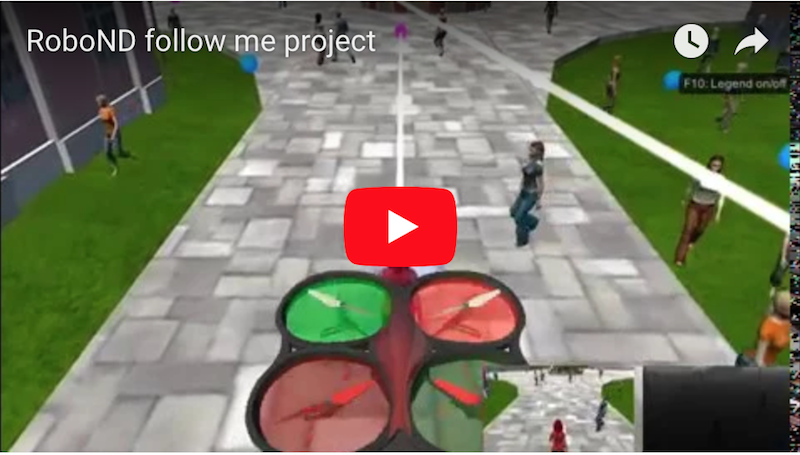

## Follow Me Project

---

[//]: # (image ref)
[fcn]: ./misc/fcn.png
[arch]: ./misc/arch.png
[1x1]: ./misc/1x1.png
[skip]: ./misc/skip.png
[following]: ./misc/following.png
[patrol-nohero]: ./misc/patrol-nohero.png
[epoch66]: ./misc/epoch66.png
[inception1x1]: ./misc/inception1x1.png
[youtube]: ./misc/youtube.png

In this project, I will build a segmentation network, train it, validate it, and deploy it in the Follow Me project. In the end, it'll be used for drone tracking and following a single hero target in the simulator!

### 1. Provide a write-up document including all rubric items addressed in a clear and concise manner

You're reading it!

### 2. The write-up conveys the an understanding of the network architecture

> The student clearly explains each layer of the network architecture and the role that it plays in the overall network. The student can demonstrate the benefits and/or drawbacks different network architectures pertaining to this project and can justify the current network with factual data. Any choice of configurable parameters should also be explained in the network architecture.

The whole pipeline (FCN) looks like below.

![Fully Convolutional Network][fcn]

#### FCN
An FCN is comprised of an encoder and decoder. It takes advantage of 3 techniques:

- Replace fully connected layer with 1x1 convolutional layer
- Upsampling through transposed convolutional layer
- Skip connections

#### Encoder
With each encoder layer, the depth of model increases and finally reduces to a deeper 1x1 convolution layer. Inside each encoder layer, it ends with a batch normalization layer which provides the following benefits:

- Networks train faster 
- Allows higher learning rates
- Simplifies the creation of deeper networks
- Provides a bit of regularization 

#### 1x1 Convolution
It's the middle part. The main benefit is it perserves spacial information from the image, which is key to segmentation problems.

![1 x 1 Convolution][1x1]

#### Bilinear Upsampling
They're used in decoder block, which is an alternative to transposed convolution. The idea is utilizes the weighted average of four nearest known pixels.

#### Skip Connections
Skip connections can combine earlier high resolution feature maps with later low resolution ones, allowing gaining information from multiple resolutions.

![skip connections][skip]

#### Separable Convolution
Separable Convolution layer is used in both encoder and decoder block. It's also known as [depthwise separable convolutions]((https://arxiv.org/pdf/1610.02357.pdf)). Unlike regular convolution, it performs convolution over each channel of an input layer and followed by a 1x1 convolution. This reduces number of parameters and therefore is quite efficient and usefuly for mobile applications.

> The student shall also provide a graph, table, diagram, illustration or figure for the overall network to serve as a reference for the reviewer.

The main pipeline can be visualized as below (Batch normalization, Separable etc is embedded) 

![Architecture][arch]

### 3. The write-up conveys the student's understanding of the parameters chosen for the the neural network.

> The student explains their neural network parameters including the values selected and how these values were obtained

Key hyperparameters:

- batch_size: number of training samples/images that get propagated through the network in a
single pass.
- num_epochs: number of times the entire training dataset gets propagated through the network.
- steps_per_epoch: number of batches of training images that go through the network in 1 epoch.
- validation_steps: number of batches of validation images that go through the network in 1 epoch
- workers: maximum number of processes to spin up. Set it to `4` (number of CPU in p2.xlarge) and never changed.

For `batch_size`, I experimented with 16, 32, 64. Not definitive conclusion can be drawn between it and the overall loss. Yet, this value needs to be changed accordingly with `step_per_epoch` and `validation_steps` (see below). Also, if it's too big it might cause out of memory issue.

For `num_epochs`, it's important to use a smaller value in the beginning to get quick feedback for vastly different hyperparameters. But later once most hyperparameters are fixed, it should be increased to train the model fully and get the best result.

For `steps_per_epoch` and `validation_steps`, according to [this](https://stackoverflow.com/a/45944225/247807) the formula is:

		steps_per_epoch = TotalTrainingSamples / TrainingBatchSize
		validation_steps = TotalvalidationSamples / ValidationBatchSize

#### Training process
Although I heard some people reported that the data is not good, I decide to only use the provided training data. Also I use the hero checker helper function and find that ~37% of training images contain at least part of hero.

In the begining, a `fcn_small` model is used to validate the pipeline as well as to establish a baseline performance. It only has 21K trainable variables and only 5 epochs are used, which allows me to find a good starting point quickly. Here's the summary.

Experiment  | fcn_small (*)
------------ | ------------- 
Arch. |8, 16, 16, 16, 8 
Epochs | 5  
Learning rate | 0.01
Num. variables | ~21K
Training time | 5 min
Final IOU | 0.369

*see notebook for detail

Seeing the final IOU result not too far from the target 0.4, I try to keep the architecture unchanged but increase the number of epochs to 15. However, the loss plateaued, which suggests underfitting.

Then I tried a much larger model `fcn_large`:

Experiment  | fcn_large (*)
------------ | ------------- 
Arch. | 64, 128, 256, 128, 64
Epochs | 20
Learning rate | 0.001
Num. variables | ~120K
Training time | 80 min
Final IOU | 0.359

This is where I spent most of time trying to tune parameters. However, it shows sign of overfitting in just a few epochs, which means the network is too large. And due to its large number of variables, it'll take 1 hour for 1 trial. And most importantly, the IOU is even worse than the small model.

Finally, I switch to `fcn_medium` which helps me reach the target 0.4 IOU.

Experiment  | fcn_medium (*)
------------ | ------------- 
Arch. | 24, 36, 64, 96, 64, 36, 24
Epochs | 80
Learning rate | 0.002
Num. variables | ~33K
Training time | 80 min
Final IOU | 0.414

There're 2 severial distinct parts of this model than the previous two:

- Nadam optimizer is used according to the good feedback in Slack
- 3 layers of encoder/decoder are used instead of just 2

Also, initially only 40 epochs were used and the IOU was 0.395! Since it's so close to target, I didn't hesitate to continue the training (first loading the saved model) for another 40 epochs. And it's in epoch 26 (total 66) that I reached minimum loss and then the best IOU.

![Epoch 66][epoch66]

### 4. The student has a clear understanding and is able to identify the use of various techniques and concepts in network layers indicated by the write-up.

> The student demonstrates a clear understanding of 1 by 1 convolutions and where/when/how it should be used.

1x1 conv filters can be used to change the dimensionality in the filter space, not in spacial dimension space. For example, 

Suppose we have a conv layer which outputs an `(N,F,H,W)` shaped tensor where:

- N is the batch size
- F is the number of convolutional filters
- H,W are the spatial dimensions

If the output of this layer is fed into 1x1 conv layer with F1 filters, then the output tensor's shape become `(N,F1,H,W)`. And if F1 < F, we reduce the fitler dimensionality. 

Yes we can also combine these 2 conv layers into one to achieve the same dimensionality reduction but 1x1 conv layer also includes non-linear activation layer like ReLU hence the convolutions are no longer linear operators and cannot be combined.

In practice, 1x1 conv layer is often used before the expensive 3x3 or 5x5 convolutions. This is probably most well known in Google's Inception architecture as below.

![Inception][inception1x1]

> The student demonstrates a clear understanding of a fully connected layer and where/when/how it should be used.

The main benefit to not use fully connected layer in this task is that FC layer will flatten the inputs hence throw away the spacial information. This is fine in a object detection task in which what matters is to tell what objects exist in a image. 

However, spacial information is key to segmentation problems, which needs to tell which object a pixel belongs to.

### 5. The student has a clear understanding of image manipulation in the context of the project indicated by the write-up.

> The student is able to identify the use of various reasons for encoding / decoding images, when it should be used, why it is useful, and any problems that may arise.

Encoders and decoders are networks, which try to reconstruct their own input. They are constructed in this wasy so that

- Encoder learns to educes the input size by using one or more hidden layers, until it reaches a reasonably small hidden layer in the middle. As a result data has been compressed (encoded) into a few variables but still keeps the key information
- Decoder learns to reconstruct (decode) the image input from the encoded information. In order to do a good job at reconstructing the input the network has to learn a good representation of the data in the middle hidden layer. 

This structure can be useful for dimensionality reduction, or for generating new “synthetic” data. For example, an application of this Autoencoder structure is to remove noise from picture or reconstruct missing parts.

Another use, which is what we are doing here is to do segmentation. The autoencoder learns to color pixels belonging to the same object in same color. Down below are some snapshots of color different objects into R,G,B.

![following target][following]

- The left is from `sample_evaluation_data`, which is captured in QuadSim
- The middle is the ground truth segmentation data
	- Blue is hero
	- Green is crowd
	- Red is background
- The right is the model's prediction output

The scoring section will then use the middle and right images to calculate IOU. Here's another snapshot showing patrol without target scenario.

![patrol without target][patrol-nohero]

### 6. The student displays a solid understanding of the limitations to the neural network with the given data chosen for various follow-me scenarios which are conveyed in the write-up.

> The student is able to clearly articulate whether this model and data would work well for following another object (dog, cat, car, etc.) instead of a human and if not, what changes would be required.

Without change I can hardly imagine the model can follow other non-human objects than the hero out of the box, simply because the model "memorize" the hero's physical shape and color. That being said, the architecture and strategy to train such a model is still valid so given enough training data, tracking other objects shouldn't be too hard to achieve.

### 7. Future Improvements

- I see many people having IOU > 0.45, which is definitely worth to try!
- Try clean the data. Many people report that removing some training images without hero could improve the result
- Try recording data using manual control

### 8. References
- [What does 1x1 convolution mean in a neural network?](https://stats.stackexchange.com/questions/194142/what-does-1x1-convolution-mean-in-a-neural-network)
- [One by One [ 1 x 1 ] Convolution - counter-intuitively useful](http://iamaaditya.github.io/2016/03/one-by-one-convolution/)
- [An Introduction to different Types of Convolutions in Deep Learning](https://towardsdatascience.com/types-of-convolutions-in-deep-learning-717013397f4d)
- [Image Segmentation](https://leonardoaraujosantos.gitbooks.io/artificial-inteligence/content/image_segmentation.html)
- [Autoencoders — Deep Learning bits #1](https://hackernoon.com/autoencoders-deep-learning-bits-1-11731e200694)